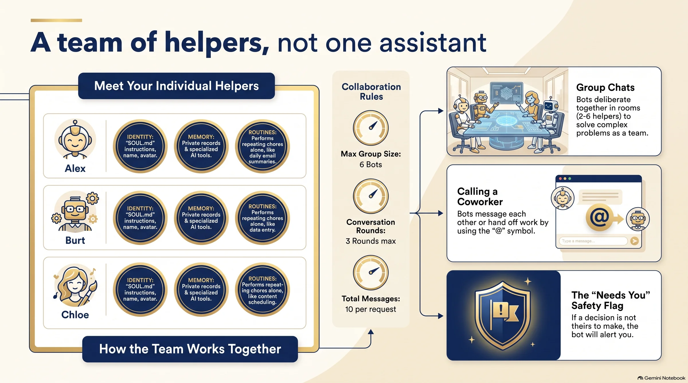

**Instead of one AI assistant that does everything, Hermes Agent lets you have a small team of helpers, each with a name of its own: its own job, its own memory and its own daily chores.** And the best part: you can put them together in a group chat and let them share out the work, only calling on you when there's a decision you need to make.

> **In short.** Hermes Agent is a free, open-source artificial intelligence assistant made by a company called Nous Research. Its «Bot Mode» turns each profile into a bot with a name, an avatar, its own memory and scheduled tasks. The bots call on each other with an @, get together in groups of 2 to 6, and put their hand up when a decision belongs to you.

---

## What is Hermes Agent, in plain English?

It's an AI assistant that you install on your own computer and that works for you. It's made by Nous Research and given away free, under an open licence (MIT). On its GitHub page it introduces itself with a line I liked: *«the agent that grows with you»*. The idea is that each time it solves a task, it learns to do it better the next time.

I have it installed on a separate Mac Mini. I send it the heavy lifting: fishing out data, checking information, getting through volume. I don't ask it for poetry. I ask it for muscle.

On 1 September I opened my ski website and thought the photo for France looked awful. I told my two agents, Larry and Hermes, in the same message. Hermes took the 41 pages on French ski resorts and went through them one by one. It found that lots of them were using the same photo: 41 pages and only 23 different photos. By that night there were 29 different photos, and the pages without a photo of their own had gone down from 18 to 11. It didn't publish a thing. Larry redid the count on his own and got exactly the same result. And the last word was mine: a spa that had sneaked in among the ski resorts, I got rid of with a handful of words: «get rid of the spa thing».

## What are Hermes «bots»?

Until now, an AI assistant was a single person with lots of conversations: one memory, one character, one brain for everything.

**Bot Mode** changes that. Each bot is a different helper, with:

- **Its own name and face.** An avatar and a title («Researcher», «Writer», «Reviewer»…).
- **Its own memory.** What one learns doesn't get mixed up with what another learns.
- **Its own character.** A file of standing instructions that Hermes calls `SOUL.md` (the bot's «soul»): «always cite the source, or say you couldn't find it».
- **Its own brain.** Each bot can run on a different AI model: a smarter, pricier one for thinking, a faster, cheaper one for simple jobs.
- **Its own tools.** You tick exactly the skills its job needs, and no more.

It comes built into the Hermes desktop app and it's switched on by default. There's nothing extra to install.

*Infographic created with NotebookLM from the official Hermes Agent documentation.*

## Can they work on their own, without me telling them every day?

Yes. Each bot can have **routines**: tasks that repeat by themselves. The example the documentation itself gives is the classic one: «summarise my email every morning». That routine belongs to the bot that does it, and the result shows up in that bot's chat. So when you open the chat with your «email bot», today's summary is already there waiting for you.

## How do the bots talk to each other?

Just like in a WhatsApp group: with an @. If, in one bot's chat, you write `@researcher have a look at this`, that bot hands the job to the researcher, waits for the answer and brings it back to you.

And they can get together. A **group chat** brings 2 to 6 bots into one room. You write once and they answer in turn. If you name one with the @, that one answers; if you don't name anyone, they all do. Each one either replies briefly or passes.

There are two details that strike me as very sensible:

1. **They have brakes.** At most 3 rounds of turns and 10 messages for every message you send. That way they don't sit up all night arguing with each other and running up the bill.
2. **They know when to stop and ask.** When a decision really isn't theirs to make, they call you with `@user`, and the group gets flagged with a **«needs you»** notice.

What's more, the bots can live on different machines. One on your laptop, another on a computer at home, another in the cloud. They all appear in the same list and talk to each other just the same.

## Why did this sound so familiar to me?

Because it's exactly how I work, just under a different roof.

At my agency I use an app called Buzz, and there I have a team of agents with names of their own: one looks after the clients and coordinates, another builds the websites, another handles social media. I write to them with an @, they pass work between themselves and hand me back a single, finished answer. I told that story in [Buzz, my new office has agents](/en/blog/036-buzz-my-new-office-has-agents/).

What I've learnt in that time applies just as well to the Hermes bots:

- **One bot, one job.** The one that does everything gets everything wrong. The one that only reviews, reviews well.
- **The brakes aren't a detail.** Without a limit on rounds, two polite machines can go on agreeing with each other forever. And every round costs money.
- **The @ that points at me is the most valuable piece.** What an AI team most needs to be good at isn't working: it's knowing when to stop and ask.

## What can I do with this today?

If installing software isn't your thing, you don't need to do it yet. But you can use the idea with the ChatGPT or Claude you already have:

1. **Think of three jobs**, not one assistant: for example, «the one who searches», «the one who writes» and «the one who checks».
2. **Write each one's soul** in four lines: what it does, what it never does, and when it has to ask you.
3. **Open a separate conversation for each one** and paste those four lines in at the start. That way their memories don't get mixed up.
4. **Be the group chat yourself**: pass what one writes to the one who checks. You'll see the difference.

If one day you feel like taking the plunge, Hermes does all of that on its own.

---

## Frequently asked questions

**Does Hermes Agent cost money?**
The program is free and open source, under the MIT licence. What you do pay for is the «brain»: the AI model each bot uses, depending on what you ask of it. That's why it makes sense to put the expensive models only on the bots that do the thinking.

**What's the difference between a bot and a new conversation?**
A new conversation shares the memory and character of the same assistant. A bot is a different helper: its own memory, its own standing instructions, its own model and its own tools. What one learns doesn't rub off on the other.

**Can the bots start talking to each other endlessly?**
No. In a group chat there are at most 3 rounds of turns and 10 messages for every message you send. If nobody has anything to add in a round, the group goes quiet on its own.

**Do I need to know how to code?**
To create bots from the desktop app, no: you fill in a name, a title and a description. To install Hermes the first time, it helps to have someone around. And the «one helper, one job» idea works today with any AI chat.

---

## About the author

**Giora Gilead Elenberg**. I run a travel agency and a small team of artificial intelligences to whom I explain, every day, what I want and what I don't. I write in Recableado what I'm learning by getting it wrong, without engineer-speak, because I don't speak it either.
