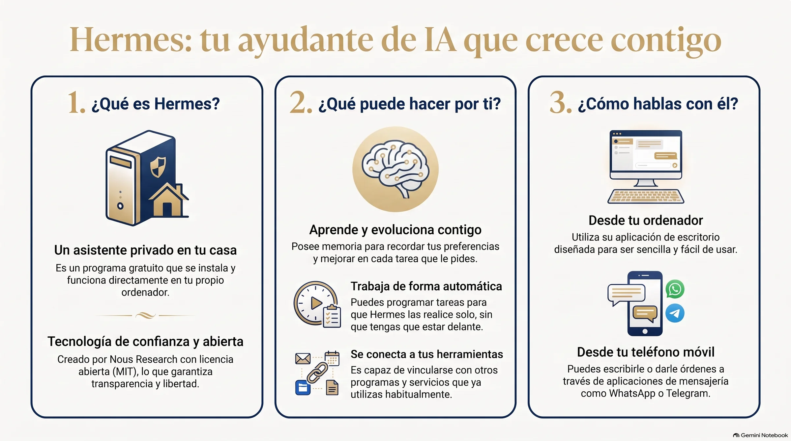
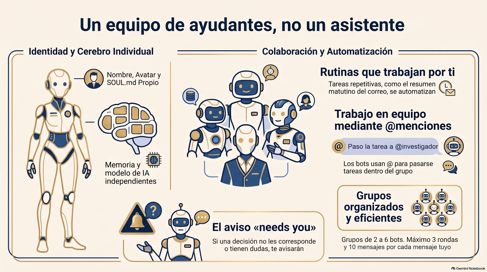

**Hermes Agent permite tener, en vez de un asistente de IA que lo hace todo, un pequeño equipo de ayudantes con nombre propio: cada uno con su oficio, su memoria y sus tareas diarias.** Y lo mejor: se pueden reunir en un chat de grupo y repartirse el trabajo entre ellos, avisándole a usted solo cuando hace falta que decida.

> **En corto.** Hermes Agent es un asistente de inteligencia artificial gratuito y de código abierto, de la empresa Nous Research. Su «Bot Mode» convierte cada perfil en un bot con nombre, avatar, memoria propia y tareas programadas. Los bots se llaman entre sí con una arroba, se reúnen en grupos de 2 a 6, y levantan la mano cuando una decisión es suya.

---

## ¿Qué es Hermes Agent, dicho sin tecnicismos?

Es un asistente de IA que se instala en su propio ordenador y trabaja para usted. Lo hace Nous Research y se reparte gratis, con licencia libre (MIT). En su página de GitHub se presenta con una frase que me gustó: *«el agente que crece contigo»*. La idea es que, cuando resuelve una tarea, aprende a hacerla mejor la siguiente vez.

Yo lo tengo instalado en un Mac Mini aparte. Le mando los trabajos pesados: pescar datos, revisar información, levantar volumen. No le pido poesía. Le pido músculo.

El 1 de septiembre abrí mi web de esquí y la foto de Francia me pareció horrible. Se lo dije a mis dos agentes, Larry y Hermes, en el mismo mensaje. Hermes cogió las 41 fichas de estaciones francesas y las comparó una a una. Descubrió que muchas repetían la misma foto: 41 fichas y solo 23 fotos distintas. Esa noche ya eran 29 fotos distintas, y las fichas sin foto propia habían bajado de 18 a 11. No publicó nada. Larry repitió el recuento por su cuenta y le salió idéntico. Y la última palabra fue mía: un balneario que se había colado entre las estaciones de esquí lo quité con cuatro palabras, «quita lo del balneario».

*Infografía creada con NotebookLM a partir de la documentación oficial de Hermes Agent.*

## ¿Qué son «los bots» de Hermes?

Hasta ahora, un asistente de IA era una sola persona con muchas conversaciones: una misma memoria, un mismo carácter, un mismo cerebro para todo.

El **Bot Mode** cambia eso. Cada bot es un ayudante distinto, con:

- **Su nombre y su cara.** Un avatar, un título («Investigador», «Redactor», «Revisor»…).
- **Su propia memoria.** Lo que aprende uno no se mezcla con lo del otro.
- **Su propio carácter.** Un fichero de instrucciones fijas, que Hermes llama `SOUL.md` (el «alma» del bot): «cita siempre la fuente o di que no la encontraste».
- **Su propio cerebro.** A cada bot se le puede poner un modelo de IA distinto: uno más listo y caro para pensar, uno más rápido y barato para tareas sencillas.
- **Sus herramientas.** Se le marcan exactamente las habilidades que necesita su oficio, y ninguna más.

Viene incluido en la aplicación de escritorio de Hermes y está encendido de serie. No hay que instalar nada aparte.

*Infografía creada con NotebookLM a partir de la documentación oficial de Hermes Agent.*

## ¿Pueden trabajar solos, sin que yo les diga nada cada día?

Sí. Cada bot puede tener **rutinas**: tareas que se repiten solas. El ejemplo que pone la propia documentación es el de toda la vida: «resúmeme el correo cada mañana». Esa rutina vive pegada al bot que la hace, y el resultado aparece en el chat de ese bot. Así, cuando usted abre el chat del «bot del correo», el resumen de hoy ya está ahí esperándole.

## ¿Cómo se hablan los bots entre ellos?

Igual que en un grupo de WhatsApp: con una arroba. Si en el chat de un bot escribe `@investigador échale un vistazo a esto`, ese bot le pasa el encargo al investigador, espera su respuesta y se la trae.

Y se pueden reunir. Un **chat de grupo** junta de 2 a 6 bots. Usted escribe una vez y ellos van contestando por turnos. Si nombra a alguno con la arroba, contesta ese; si no nombra a nadie, contestan todos. Cada uno responde en corto o pasa.

Hay dos detalles que me parecen de gente sensata:

1. **Tienen freno.** Como máximo 3 rondas de turnos y 10 mensajes por cada mensaje suyo. Así no se quedan discutiendo entre ellos toda la noche, gastando.
2. **Saben cuándo parar y preguntar.** Cuando una decisión de verdad no les corresponde, le llaman a usted con `@user`, y el grupo se marca con un aviso de **«needs you»** (le necesitamos).

Además, los bots pueden vivir en máquinas distintas. Uno en su portátil, otro en un ordenador de casa, otro en la nube. Aparecen todos en la misma lista y se hablan igual.

## ¿Por qué a mí esto me sonó tan familiar?

Porque es exactamente como trabajo yo, solo que en otra casa.

En mi agencia uso una aplicación que se llama Buzz, y ahí tengo un equipo de agentes con nombre propio: uno lleva los clientes y coordina, otro programa las webs, otro las redes. Les escribo con arroba, se pasan trabajo entre ellos y me devuelven una sola respuesta montada. Ya lo conté en [Buzz, mi nueva oficina de agentes](/blog/036-buzz-mi-nueva-oficina-agentes-ia/).

Lo que he aprendido en ese tiempo vale igual para los bots de Hermes:

- **Un bot, un oficio.** El que lo hace todo se equivoca en todo. El que solo revisa, revisa bien.
- **El freno no es un detalle.** Sin límite de rondas, dos máquinas educadas pueden darse la razón la una a la otra hasta el infinito. Y cada ronda cuesta dinero.
- **La arroba hacia mí es la pieza más valiosa.** Lo que un equipo de IA tiene que saber hacer mejor no es trabajar: es saber cuándo parar y preguntar.

## ¿Qué puedo hacer yo hoy con esto?

Si no es usted de instalar programas, no hace falta que lo haga todavía. Pero sí puede usar la idea con el ChatGPT o el Claude que ya tiene:

1. **Piense en tres oficios**, no en un asistente: por ejemplo, «el que busca», «el que escribe» y «el que revisa».
2. **Escriba el alma de cada uno** en cuatro líneas: qué hace, qué no hace nunca y cuándo tiene que preguntarle a usted.
3. **Abra una conversación distinta para cada uno** y pegue esas cuatro líneas al empezar. Así no se le mezclan las memorias.
4. **Hágale usted de chat de grupo**: pase lo que escribe uno al que revisa. Verá la diferencia.

Si un día le apetece dar el paso, Hermes hace todo eso solo.

---

## Preguntas frecuentes

**¿Hermes Agent cuesta dinero?**
El programa es gratuito y de código abierto, con licencia MIT. Lo que sí se paga es el «cerebro»: el modelo de inteligencia artificial que usa cada bot, según lo que se le pida. Por eso conviene poner los modelos caros solo en los bots que piensan.

**¿Qué diferencia hay entre un bot y una conversación nueva?**
Una conversación nueva comparte la memoria y el carácter del mismo asistente. Un bot es un ayudante distinto: su propia memoria, sus instrucciones fijas, su modelo y sus herramientas. Lo que aprende uno no se le mezcla al otro.

**¿Los bots pueden ponerse a hablar entre ellos sin fin?**
No. En un chat de grupo hay, como máximo, 3 rondas de turnos y 10 mensajes por cada mensaje que usted envía. Si nadie tiene nada que añadir en una ronda, el grupo se calla solo.

**¿Hace falta saber programar?**
Para crear bots desde la aplicación de escritorio, no: se rellena nombre, título y descripción. Para instalar Hermes la primera vez sí ayuda tener a alguien cerca. Y la idea de «un ayudante, un oficio» se puede usar hoy con cualquier chat de IA.

---

## Sobre el autor

**Giora Gilead Elenberg**. Tengo una agencia de viajes y un pequeño equipo de inteligencias artificiales a las que explico, cada día, lo que quiero y lo que no. Escribo en Recableado lo que voy aprendiendo a base de equivocarme, sin lenguaje de ingeniero, porque yo tampoco lo hablo.
